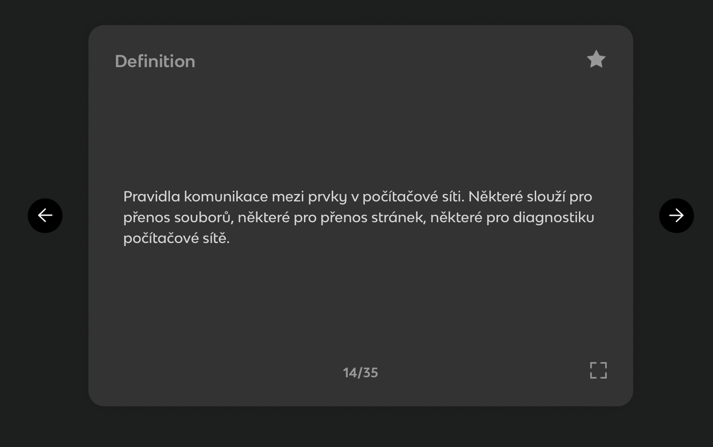
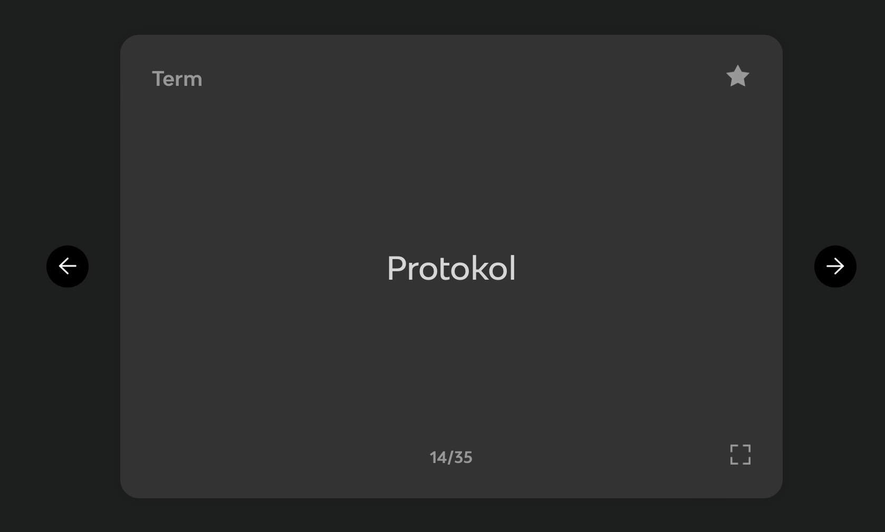
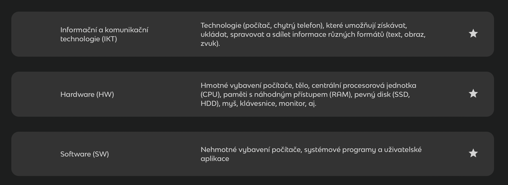

# cardlet

## O projektu
Projekt Cardlet představuje open-source verzi projektů kartičkových didaktických softwarů typu Quizlet. Cílem je poskytnout jednoduchou webovou aplikaci, do které si učitel nahraje v TOML formátu otáčecí kartičky a během hodiny s nimi didakticky pracuje. Aplikace je jedna z chystaných aplikací, které budou volně dostupné na serveru přírodovědecké fakulty UJEP pro učitele. 

Projekt vzniká z iniciativy zaměstnance katedry informatiky Pavla Beránka, kterému se nelíbí komercializace didaktických online aplikací, které byly dlouhou dobu zdarma, byly pro ně vytvářené školení a nově jsou zpoplatněné. Projekt je vyvíjen dobrovolníky a studenty kurzů z Bee IT a UJEP. Jedná se o jeden z projektů, který díky své jednoduchosti, slouží pro nácvik procesu vývoje softwaru.

## Technologický zásobník
Pro projekt byla zvolen mikro pracovní rámec Flask v jazyce Python jako hlavní programovací jazyk na straně serveru. Stylovací pracovní rámec bude Bootstrap 5 a potřebné interakce budou řešené jednoduchým Javascriptem. V případě vzniku složitějších požadavků bude použit pracovní rámec React.

## Stav projektu (15.6.2023)
Aktuálně je stav projektu v úplných začátcích, chybí design, architektura, programátoři. Zkrátka vše. Výsledný produkt se bude inspirovat aplikací knowt.io, která ovšem není optimalizovaná pro využití do výuky (full-screen nevede na karty přes celý displej aj.).

Každá karta má svou odkrytou stranu, kterou mají studenti před očima.

Při kliku nebo zmáčknutí dedikované klávesy se karta obrátí a ukáže svou skrytou stranu (typicky odpověď na otázku z odkryté strany).

Software musí poskytovat editor sady karet.

Prozatimní verze nebude předpokládat ukládání dat na stranu serveru, takže musí jít sada vytvořených karet uložit do snadno přenositelného souboru, který lze kdykoliv nahrát zpět. Zvoleným formátem bude TOML díky jeho snadné integraci do jazyka Python.

## Jak přispět do kódové báze

V sekci Issues naleznete aktuální problémy, které je nutné vyřešit (funkční požadavky, nalezené bugy atd.). Vyberte si nějaký issue a přiřaďte si ho v pravé části popisu issue (položka Assignees po rozkliknutí daného issue). Následně si v pravé části vespod vytvořte k issue větev (položka development, create a branch for this issue). Nějak vhodně pojmenujte větev, branch source nechte (main) a dejte checkout locally. Vygenerují se vám příkazy fetch origin a checkout s názvem větve. Ty vložte do terminálu ve VS Code nebo vašem jiném IDE a tím si stáhnete vámi vytvořenou větev pro issue.

Po vložení do terminálu a spuštění byste měli být přepnuti do vaší nově větve a můžete naprogramovat změnu. Pomocí git add . a git commit -m "vámi napsaný commit message a git push nahráváte kód do vaší větve na githubu (můžete zkontrolovat v online repozitáři). Až budete mít issue hotový, tak dáte v githubu Pull Request na větev main. Já pak změnu zkontroluji a provedu sloučení vašeho řešení do main větve.

## Přispěvovatelé
Pavel Beránek (Vedoucí programátor, PřF UJEP)
